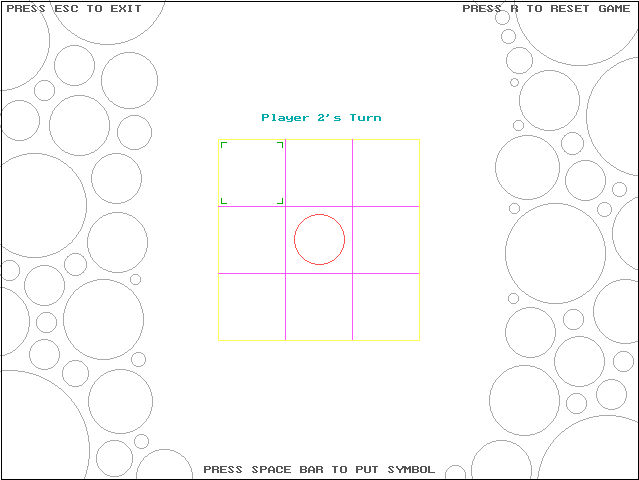

# Tic Tac Toe in C language using <graphics.h>

A graphical based Tic Tac Toe two player game in your nostalgic language, C !

- Just clone TICTAC.C file into your local PC and paste it into C++ emulator, for eg. TURBOC3/BIN/ or what ever your path is, open your C++ emulator.
- Open file named TICTAC.C run it, Bingo! You have a game in C which is mainly used for printing "Hello world" in console ;)

Game menu screen

Use arrow keys from your keynoard to move your choice to fill, Player 1's turn

Player 2's turn...

Player 1's turn...

Player 1 Won!

Player 2 Won!
